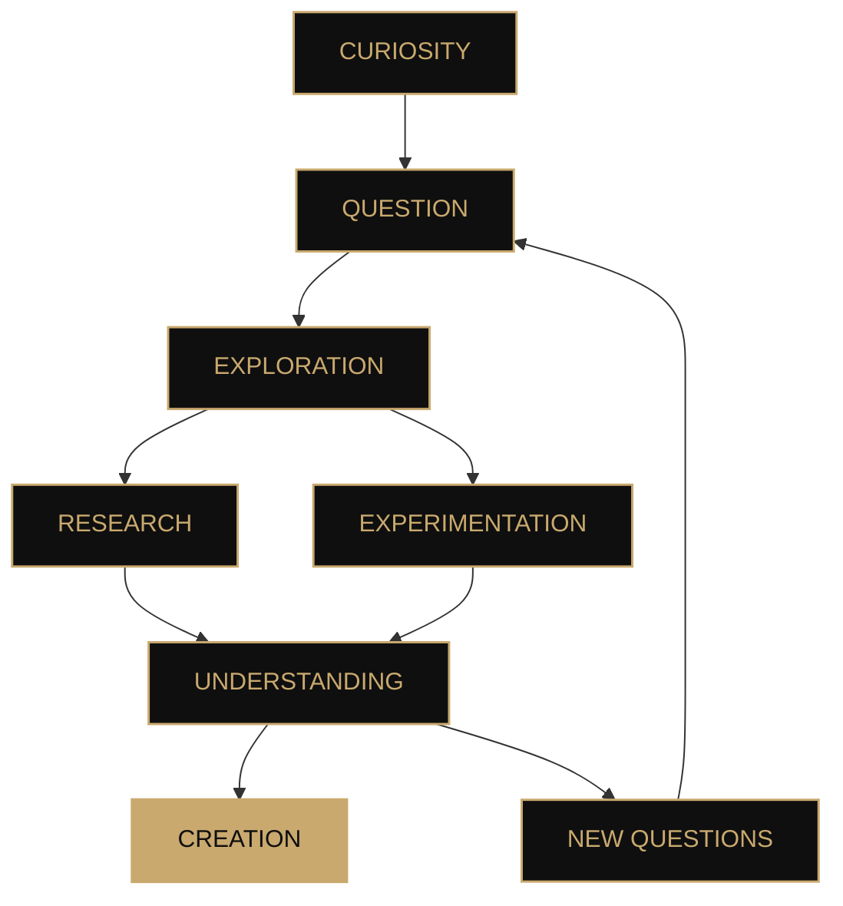

<!--
  ╔══════════════════════════════════════════════════════════════╗
  ║                         MALICÆUS                            ║
  ║             Intelligence · Systems · Science               ║
  ╚══════════════════════════════════════════════════════════════╝
-->

 

 

# **Malicæus**

### `Aurum potestas est`

*Observe. Understand. Build.*

 

 

---

## Ⅰ · About

> **The best ideas often begin with a question.**
>
> *Then come experimentation, architecture, and a few lines of code.*

Malicæus is my personal space for **research, experimentation, and digital creation**.

I explore ideas at the intersection of **technology, science, and software design**. Sometimes to build a tool, sometimes to understand a concept, and sometimes simply to see how far an idea can go.

My interests mainly revolve around:

* 🤖 **Artificial Intelligence & Machine Learning**
* 💻 **Software Engineering & Web Development**
* 🛡️ **Security & Privacy**
* ⚛️ **Science & Emerging Technologies**
* 🧬 **Digital Health & Biology**
* ☁️ **Systems, Infrastructure & Automation**

I value systems that are **coherent, understandable, and durable**: technology becomes interesting when it turns an idea into something real.

---

## Ⅱ · An approach

### `CURIOSITY`

**Start by understanding.**

Curiosity often comes before the solution.
I prefer exploring a problem in depth before deciding how to solve it.

 

### `PRECISION`

**Every detail matters.**

Architecture, interface, performance, or security:
small decisions eventually define the whole.

 

### `EXPERIMENTATION`

**Build to learn.**

Not every project is meant to become a product.
Some simply exist to test a hypothesis.

 

### `ELEGANCE`

**Keep complexity under control.**

A sophisticated system does not need to be unnecessarily complicated.

---

## Ⅲ · Technologies

### `LANGUAGES`

  

### `WEB · APPLICATIONS`

  

### `SYSTEMS · INFRASTRUCTURE`

  

### `DOMAINS`

`Artificial Intelligence` · `Security` · `Privacy` · `Automation`
`Scientific Computing` · `Digital Health` · `Distributed Systems`

---

## Ⅳ · Projects

### ◈ Featured projects

<table>
<tr>
<td width="50%" valign="top">

### 🧠 BlackBox

**Cryptography · Security · Research**

An experiment focused on data protection and modern cryptographic architectures.

The project explores the combination of cryptographic mechanisms in order to study their properties, limitations, and integration into a real application.

`TypeScript` · `React` · `Cryptography`

 

→ **[Explore the project](https://blackbox-demo.vercel.app/)**

</td>

<td width="50%" valign="top">

### 🌌 LostHorizon

**Exploration · Systems · Game Design**

A Minecraft mod built around exploration, progression, and new gameplay systems.

The goal is to create a coherent world rather than simply a collection of features.

`Java` · `NeoForge`

 

→ **[View repository](https://github.com/malicaeus/LostHorizon)**

</td>
</tr>

<tr>
<td width="50%" valign="top">

### 🗝️ BlackNote

**Privacy · Local-first · Software**

A note-taking application built around a simple principle: keep data where it belongs.

Local architecture, encryption, and a minimal interface come together in an application designed to remain simple to use.

`TypeScript` · `React` · `ChaCha20`

 

→ **[View repository](https://github.com/malicaeus/BlackNote)**

</td>

<td width="50%" valign="top">

### 📚 Codex

**Knowledge · Markdown · Web**

A modern wiki built around Markdown files.

The goal: preserve the simplicity and portability of plain text while providing a modern reading experience.

`TypeScript`

 

→ **[View repository](https://github.com/malicaeus/Codex)**

</td>
</tr>
</table>

---

### ◇ Experiments

<strong>Explore other work</strong>

 

| Project                                                                                  | Domain                 | Technologies                |
| :--------------------------------------------------------------------------------------- | :--------------------- | :-------------------------- |
| 📡 **[Wigle-Stats-HA](https://github.com/malicaeus/Wigle-Stats-HA)**                     | Data · Home Automation | `Python` · `Home Assistant` |
| 📜 **[Awesome-Readme-Templates](https://github.com/malicaeus/Awesome-Readme-Templates)** | Design · Open Source   | `Markdown`                  |

---

## Ⅴ · Research & curiosity

*Some ideas become projects.*
*Others remain simply experiments.*

---

## Ⅵ · GitHub activity

  

---

## Ⅶ · Principia

### `I`

**Question everything.**

### `II`

**Build with intention.**

### `III`

**Prefer understanding to imitation.**

### `IV`

**Let simplicity survive complexity.**

### `V`

**Leave room for the unknown.**

---

### *Ad astra per aspera*

*Curiosity · Precision · Science · Elegance · Progress*

 

[🇫🇷 **Version française**](./README.md)

 

Some things are more interesting when discovered than explained. ✦

