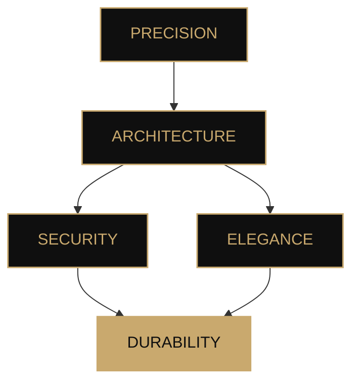

<!--
  ╔══════════════════════════════════════════════════════════════╗
  ║                         MALICÆUS                            ║
  ║              Cryptography · Architecture · Discretion      ║
  ╚══════════════════════════════════════════════════════════════╝
-->

 

 

# **Malicæus**

### `Aurum potestas est`

*Build with precision. Secure with rigor. Design to endure.*

 

 

---

## Ⅰ · About

> **Technology is not merely a matter of performance.
> It is a matter of architecture, trust, and mastery.**

I design digital systems with particular attention to **security**, **architectural coherence**, and user experience.

My approach lies at the intersection of several disciplines:

* 🔐 **Cryptography & security**
* 🏛️ **Software architecture**
* ⚛️ **Emerging technologies**
* 💻 **Full-stack development**
* ☁️ **Infrastructure & automation**
* 🎨 **Digital design**

Every project is conceived as a crafted work: **simple in intent, rigorous in execution, and built to endure.**

---

## Ⅱ · Expertise

### `LANGUAGES`

  

### `FRAMEWORKS · LIBRARIES`

  

### `CLOUD · DEVOPS`

  

### `SECURITY · SYSTEMS`

  

`Post-Quantum Cryptography` · `Applied Cryptography` · `Network Security`

---

## Ⅲ · Projects

### ◈ Featured Projects

<table>
<tr>
<td width="50%" valign="top">

### 🔐 BlackBox

**Hybrid post-quantum encryption**

A hybrid encryption architecture combining symmetric cryptography, authentication, and mechanisms designed to withstand future threats.

`TypeScript` · `React` · `Cryptography`

 

→ **[Explore the project](https://blackbox-demo.vercel.app/)**

</td>

<td width="50%" valign="top">

### 🌌 LostHorizon

**Minecraft · Exploration · Progression**

A Minecraft mod focused on exploration, introducing new structures, creatures, professions, and an expanded progression system.

`Java` · `NeoForge`

 

→ **[View repository](https://github.com/malicaeus/LostHorizon)**

</td>
</tr>

<tr>
<td width="50%" valign="top">

### 🗝️ BlackNote

**Encrypted local notes**

A note manager built around a simple principle: data stays local and is encrypted end-to-end.

`TypeScript` · `React` · `ChaCha20`

 

→ **[View repository](https://github.com/malicaeus/BlackNote)**

</td>

<td width="50%" valign="top">

### 📜 Awesome-Readme-Templates

**README · Design · Open Source**

A collection of README templates designed to create clean, elegant, and coherent GitHub profiles.

`Markdown`

 

→ **[View repository](https://github.com/malicaeus/Awesome-Readme-Templates)**

</td>
</tr>
</table>

---

### ◇ Other Works

<strong>View other projects</strong>

 

| Project                                                              | Description                                     | Technologies                |
| :------------------------------------------------------------------- | :---------------------------------------------- | :-------------------------- |
| 📡 **[Wigle-Stats-HA](https://github.com/malicaeus/Wigle-Stats-HA)** | WiGLE statistics integrated into Home Assistant | `Python` · `Home Assistant` |
| 📚 **[Codex](https://github.com/malicaeus/Codex)**                   | Modern wiki based on Markdown files             | `TypeScript`                |

---

## Ⅳ · Philosophy

### `SECURITY`

**Secure by design.**

Security should not be a layer added at the end of a project.
It should be present from the very beginning of its design.

 

### `SIMPLICITY`

**Mastered complexity.**

Technical sophistication only has value when it genuinely serves the system.

 

### `DURABILITY`

**Built to last.**

A good system should be able to evolve without losing its coherence.

---

## Ⅴ · GitHub Activity

  

---

## Ⅵ · In a Few Words

 

**Curiosity · Precision · Security · Elegance · Progress**

---

### *Memento mori · Ad astra per aspera · In perpetuum*

 

[🇫🇷 **French version**](./README.md)

 

Your trust honors me. A star on a repository is always appreciated. ✦

