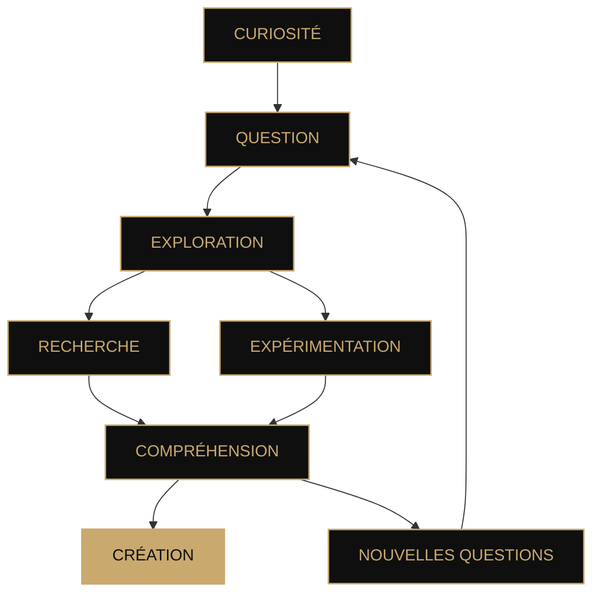

<!--
  ╔══════════════════════════════════════════════════════════════╗
  ║                         MALICÆUS                            ║
  ║              Intelligence · Systèmes · Science             ║
  ╚══════════════════════════════════════════════════════════════╝
-->

 

 

# **Malicæus**

### `Aurum potestas est`

*Observer. Comprendre. Construire.*

 

 

---

## Ⅰ · À propos

> **Les meilleures idées commencent souvent par une question.**
>
> *Puis viennent l'expérimentation, l'architecture et quelques lignes de code.*

Malicæus est mon espace personnel de **recherche, d'expérimentation et de création numérique**.

J'y explore des idées à la frontière entre **technologie, science et conception logicielle**. Parfois pour construire un outil, parfois pour comprendre un concept, parfois simplement pour voir jusqu'où une idée peut aller.

Mes centres d'intérêt gravitent notamment autour de :

* 🤖 **Intelligence artificielle & apprentissage automatique**
* 💻 **Génie logiciel & développement web**
* 🛡️ **Sécurité & confidentialité**
* ⚛️ **Sciences & technologies émergentes**
* 🧬 **Santé numérique & biologie**
* ☁️ **Systèmes, infrastructure & automatisation**

Je privilégie les systèmes **cohérents, compréhensibles et durables** : une technologie n'est intéressante que lorsqu'elle permet de transformer une idée en quelque chose de réel.

---

## Ⅱ · Une approche

### `CURIOSITÉ`

**Commencer par comprendre.**

La curiosité précède souvent la solution.
Je préfère explorer un problème en profondeur avant de décider comment le résoudre.

 

### `PRÉCISION`

**Chaque détail compte.**

Architecture, interface, performance ou sécurité :
les petits choix finissent par définir l'ensemble.

 

### `EXPÉRIMENTATION`

**Construire pour apprendre.**

Tous les projets n'ont pas vocation à devenir des produits.
Certains existent simplement pour tester une hypothèse.

 

### `ÉLÉGANCE`

**La complexité doit rester maîtrisée.**

Un système sophistiqué n'a pas besoin d'être inutilement compliqué.

---

## Ⅲ · Technologies

### `LANGAGES`

  

### `WEB · APPLICATIONS`

  

### `SYSTÈMES · INFRASTRUCTURE`

  

### `DOMAINES`

`Intelligence artificielle` · `Sécurité` · `Confidentialité` · `Automatisation`
`Calcul scientifique` · `Santé numérique` · `Systèmes distribués`

---

## Ⅳ · Projets

### ◈ Projets en vedette

<table>
<tr>
<td width="50%" valign="top">

### 🧠 BlackBox

**Cryptographie · Sécurité · Recherche**

Une expérimentation autour de la protection des données et des architectures cryptographiques modernes.

Le projet explore notamment la combinaison de mécanismes cryptographiques afin d'étudier leurs propriétés, leurs limites et leur intégration dans une application réelle.

`TypeScript` · `React` · `Cryptography`

 

→ **[Explorer le projet](https://blackbox-demo.vercel.app/)**

</td>

<td width="50%" valign="top">

### 🌌 LostHorizon

**Exploration · Systèmes · Game Design**

Un mod Minecraft construit autour de l'exploration, de la progression et de nouveaux systèmes de jeu.

L'objectif est de créer un univers cohérent plutôt qu'une simple collection de fonctionnalités.

`Java` · `NeoForge`

 

→ **[Voir le dépôt](https://github.com/malicaeus/LostHorizon)**

</td>
</tr>

<tr>
<td width="50%" valign="top">

### 🗝️ BlackNote

**Confidentialité · Local-first · Logiciel**

Un gestionnaire de notes conçu autour d'un principe simple : garder les données là où elles appartiennent.

Architecture locale, chiffrement et interface minimaliste se rencontrent dans une application pensée pour rester simple à utiliser.

`TypeScript` · `React` · `ChaCha20`

 

→ **[Voir le dépôt](https://github.com/malicaeus/BlackNote)**

</td>

<td width="50%" valign="top">

### 📚 Codex

**Connaissance · Markdown · Web**

Un wiki moderne construit autour de fichiers Markdown.

L'objectif : conserver la simplicité et la portabilité du texte tout en offrant une expérience de consultation moderne.

`TypeScript`

 

→ **[Voir le dépôt](https://github.com/malicaeus/Codex)**

</td>
</tr>
</table>

---

### ◇ Expérimentations

<strong>Explorer les autres travaux</strong>

 

| Projet                                                                                   | Domaine              | Technologies                |
| :--------------------------------------------------------------------------------------- | :------------------- | :-------------------------- |
| 📡 **[Wigle-Stats-HA](https://github.com/malicaeus/Wigle-Stats-HA)**                     | Données · Domotique  | `Python` · `Home Assistant` |
| 📜 **[Awesome-Readme-Templates](https://github.com/malicaeus/Awesome-Readme-Templates)** | Design · Open Source | `Markdown`                  |

---

## Ⅴ · Recherche & curiosité

*Certaines idées deviennent des projets.*
*D'autres restent simplement des expériences.*

---

## Ⅵ · Activité GitHub

  

---

## Ⅶ · Principia

### `I`

**Tout questionner.**

### `II`

**Construire avec intention.**

### `III`

**Comprendre avant d'imiter.**

### `IV`

**Laisser la simplicité survivre à la complexité.**

### `V`

**Laisser une place à l'inconnu.**

---

### *Ad astra per aspera*

*Curiosité · Précision · Science · Élégance · Progrès*

 

[🇬🇧 **English version**](./EN-README.md)

 

Certaines choses sont plus intéressantes lorsqu'elles sont découvertes que lorsqu'elles sont expliquées. ✦

