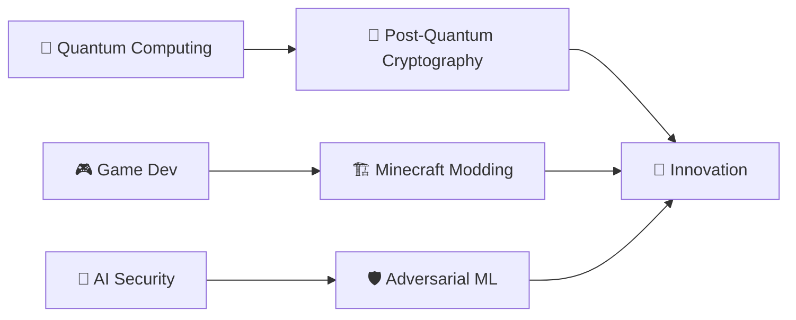

<!-- meta -->
<meta name="keywords" content="Malicæus, cybersécurité, hacking, ethical hacking, cryptographie, développeur fullstack, post-quantum, tech obscure">
<meta name="author" content="Malicæus">

# 👁️ Salut, je suis Malicæus

---

## 🕵️ À propos de moi

Je navigue dans les **zones obscures du code**, là où la technologie rencontre la sécurité et l'ingéniosité. Développeur full-stack et cryptographe amateur, je transforme des systèmes complexes en architectures élégantes et robustes, toujours avec un regard analytique et un goût pour le secret.  

Quand je ne trace pas de flux de données ou ne scrute pas des vulnérabilités, je m'immerge dans des mondes virtuels ou je teste les limites de systèmes expérimentaux.  

*[🇬🇧 English version available here](./EN-README.md)*

---

## 🛠️ Arsenal Technique

### Langages

### Frameworks & Librairies

### DevOps & Cloud

### Sécurité & Outils

---

## 🎯 Projets en cours

| 🎮 **LostHorizon** | 💼 **BlackVault Templates** | 🔒 **BlackBox** |
|:---:|:---:|:---:|
| Mod Minecraft RPG fusionnant magie et technologie | Templates obscurs pour Readme & portfolios | Plateforme de chiffrement quantum-resistant |
| `Java` `NeoForge` `JSON` | `Markdown` | `React` `Cryptography` `Post-Quantum` |

### 🌟 Projets récents

- **🎯 BlackBox** - [Live Demo](https://blackbox-demo.vercel.app/) - Système de chiffrement avancé avec résistance post-quantique  
    - AES, ChaCha20, Kyber, et algorithmes custom  
    - Mode furtif et génération sécurisée de jetons  
    - `React` `TypeScript` `Cryptographie` `Post-Quantum`

- **📜 BlackVault Templates** - [Projet](https://github.com/malicaeus/Awesome-Readme-Templates) - Templates professionnels pour README  
    - Du simple au complexe, designs élégants et mystérieux  
    - Mode "Quick Start" avec personnalisation pas-à-pas  
    - `Markdown` `GitHub` `Badges` `Mermaid` `Portfolio`

---

## 📈 GitHub Stats

---

## 🎓 Savoir & Obscurité

### 📚 Focus actuel
- **Cryptographie post-quantique & sécurité moderne**
- **Développement immersif sur Minecraft/NeoForge**
- **AI appliquée à la détection de menaces**
- **Optimisation pour systèmes à haute charge**

---

## 🏆 Expertise

| Cybersécurité | Développement | Cloud & DevOps |
|:---:|:---:|:---:|
| 🎯 Penetration Testing | ⚡ Performance Optimization | ☁️ Cloud Architecture |
| 🔐 Ethical Hacking | 🎨 UI/UX Implementation | 🔄 CI/CD Pipelines | | 🛡️ Security Auditing | 📱 Responsive Design | 🐳 Containerization |

## 💬 Collaborons dans l'ombre
Je recherche toujours des projets qui repoussent les limites : applications web, sécurité, IA ou univers immersifs.

- 🚀 Développement moderne & sophistiqué
- 🔒 Sécurisation avancée d'infrastructures
- 🎮 Expériences ludiques & immersives
- 🤖 IA & sécurité offensive

### 📫 Restons connectés

---

⭐ **Si mes projets vous intéressent, n'hésitez pas à laisser une étoile !** ⭐

