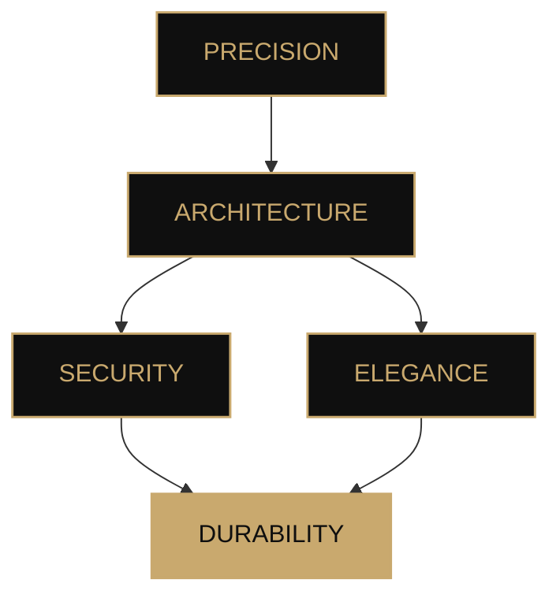

<!--
  ╔══════════════════════════════════════════════════════════════╗
  ║                         MALICÆUS                            ║
  ║              Cryptographie · Architecture · Discrétion     ║
  ╚══════════════════════════════════════════════════════════════╝
-->

 

 

# **Malicæus**

### `Aurum potestas est`

*Construire avec précision. Sécuriser avec rigueur. Concevoir pour durer.*

 

 

---

## Ⅰ · À propos

> **La technologie n'est pas seulement une question de performance.
> C'est une question d'architecture, de confiance et de maîtrise.**

Je conçois des systèmes numériques avec une attention particulière portée à la **sécurité**, à la **cohérence architecturale** et à l'expérience utilisateur.

Mon approche se situe à l'intersection de plusieurs domaines :

* 🔐 **Cryptographie & sécurité**
* 🏛️ **Architecture logicielle**
* ⚛️ **Technologies émergentes**
* 💻 **Développement full-stack**
* ☁️ **Infrastructure & automatisation**
* 🎨 **Design numérique**

Chaque projet est pensé comme un ouvrage : **simple dans son intention, rigoureux dans son exécution et durable dans sa conception.**

---

## Ⅱ · Savoir-faire

### `LANGUAGES`

  

### `FRAMEWORKS · LIBRARIES`

  

### `CLOUD · DEVOPS`

  

### `SECURITY · SYSTEMS`

  

`Post-Quantum Cryptography` · `Applied Cryptography` · `Network Security`

---

## Ⅲ · Projets

### ◈ Projets phares

<table>
<tr>
<td width="50%" valign="top">

### 🔐 BlackBox

**Chiffrement hybride post-quantique**

Une architecture de chiffrement combinant cryptographie symétrique, authentification et mécanismes résistants aux menaces futures.

`TypeScript` · `React` · `Cryptography`

 

→ **[Explorer le projet](https://blackbox-demo.vercel.app/)**

</td>

<td width="50%" valign="top">

### 🌌 LostHorizon

**Minecraft · Exploration · Progression**

Un mod Minecraft centré sur l'exploration, les structures inédites, les créatures et un système de progression enrichi.

`Java` · `NeoForge`

 

→ **[Voir le dépôt](https://github.com/malicaeus/LostHorizon)**

</td>
</tr>

<tr>
<td width="50%" valign="top">

### 🗝️ BlackNote

**Notes locales chiffrées**

Un gestionnaire de notes pensé autour d'un principe simple : les données restent locales et sont chiffrées de bout en bout.

`TypeScript` · `React` · `ChaCha20`

 

→ **[Voir le dépôt](https://github.com/malicaeus/BlackNote)**

</td>

<td width="50%" valign="top">

### 📜 Awesome-Readme-Templates

**README · Design · Open Source**

Une collection de modèles README conçus pour créer des profils GitHub sobres, élégants et cohérents.

`Markdown`

 

→ **[Voir le dépôt](https://github.com/malicaeus/Awesome-Readme-Templates)**

</td>
</tr>
</table>

---

### ◇ Autres réalisations

<strong>Voir les autres projets</strong>

 

| Projet                                                               | Description                                   | Technologies                |
| :------------------------------------------------------------------- | :-------------------------------------------- | :-------------------------- |
| 📡 **[Wigle-Stats-HA](https://github.com/malicaeus/Wigle-Stats-HA)** | Statistiques WiGLE intégrées à Home Assistant | `Python` · `Home Assistant` |
| 📚 **[Codex](https://github.com/malicaeus/Codex)**                   | Wiki moderne basé sur des fichiers Markdown   | `TypeScript`                |

---

## Ⅳ · Philosophie

### `SECURITY`

**Secure by design.**

La sécurité ne devrait pas être une couche ajoutée à la fin d'un projet.
Elle doit être présente dès sa conception.

 

### `SIMPLICITY`

**Complexité maîtrisée.**

La sophistication technique n'a de valeur que lorsqu'elle sert réellement le système.

 

### `DURABILITY`

**Built to last.**

Un bon système doit pouvoir évoluer sans perdre sa cohérence.

---

## Ⅴ · Activité GitHub

  

---

## Ⅵ · En quelques mots

 

**Curiosity · Precision · Security · Elegance · Progress**

---

### *Memento mori · Ad astra per aspera · In perpetuum*

 

[🇬🇧 **English version**](./EN-README.md)

 

Une étoile sur un dépôt est toujours appréciée. ✦

